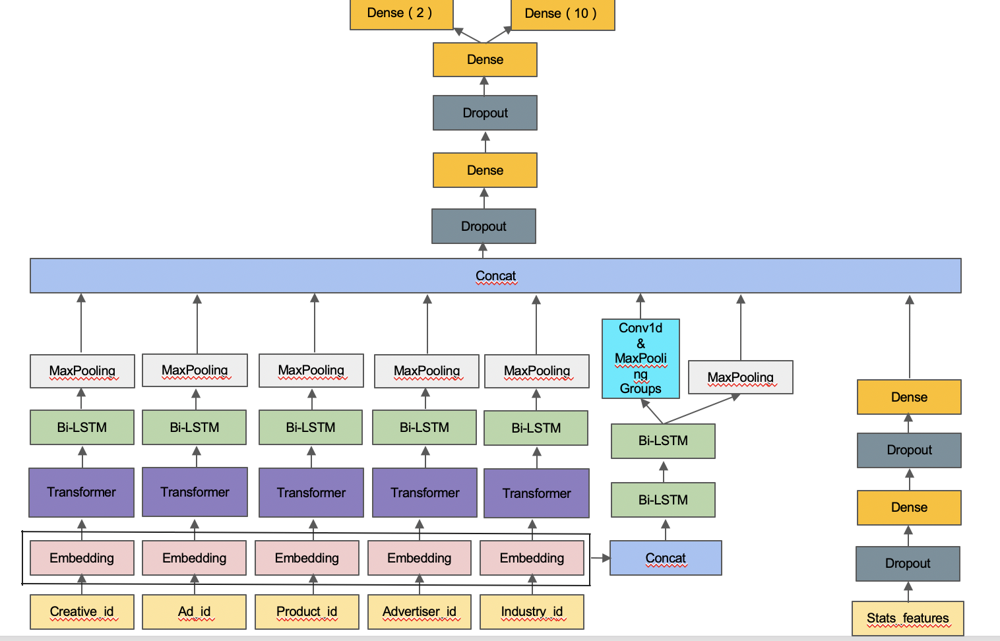

# 2020腾讯广告算法大赛
广告受众基础属性预估 - 根据用户(train: 300w, test: 100w)91(i.e. 连续3个月)天历史点击广告行为,同时预测出其年龄和性别,研究意义为填补缺失人口统计学特征为进行基于人口统计特征的智能定向和受众保护打下基础,以性别准确率 + 年龄准确率为评估指标，最终线上1.47659/2,ranking 37/1008.  

* [比赛官网链接](https://algo.qq.com/index.html?lang=en)
* [参赛手册](./docs/2020腾讯广告算法大赛参赛手册.pdf)
* [原始输入数据说明](./docs/2020腾讯广告算法大赛数据说明.xlsx)
* [数据分析报告](./docs/数据分析报告.docx)

## 一、 解决方案
视为脱敏情况下的文本分类任务, 以每个用户点击序列为文本训练embedding以及传统统计特征为输入, 构建基于age loss 以及gender loss的双weight loss模型并通过从模型结构,词向量等方面构建多个差异化,最后通过线性加权做ensemble,生成最终结果.
### 1.1. 数据预处理
* 将nan值当成新的类别;
* 根据用户点击广告序列长度分布进行序列截断.
### 1.2. 特征工程
* 统计特征(i.e. 通过统计特征捕捉用户活跃度以及兴趣广泛程度, [连续性特征重要性](./figs/连续性特征权重.jpg)以及[离散性特征重要性](./figs/离散性特征权重.jpg)).
    * 用户最长连续活跃天数以及活跃天数;
    * 按年龄分group,统计每个group点击最多的广告,然后剔除掉topn个共现频率高的广告;
    * 用户最长,平均,方差隔多少天产生一次点击行为;
    * 在advertiser_id以及product_category上的clicking time最大值,最小值, 均值,方差.
* embedding特征(i.e. 通过w2v, glove以及deepwalk等方法将各id转换为稠密向量)
    * creative_id, ad_id, product_id, advertiser_id以及industry_id.
### 1.3. 模型结构

### 1.4. 个人上分点
* 训练embedding - 利用w2v预训练embedding时,min_count可设为1,尽量保留所有词, 词表可能过大, time, memory and accuracy trade-off;
* 利用变长的bilstm - 利用负无穷mask掉冗余部分;
* 基于业务场景做数据增强 - 每个epoch以click times为权重, random_choice 2/3的序列作为输入;
* 将模型结构与业务场景结合 - 将transformer attention mask以click times替代, 为每个id引入用户兴趣权重;
* 利用传统特征工程的统计特征 - 将传统统计特征通过embedding或mlp等方式融入网络;
* 学习率衰减 - 利用固定步长衰减,余弦退火等 LR Schedule + ReduceLROnPlateau等,在有earyl stopping情况下增加训练轮数;
* 多折结果融合 - 多个fold结果的prob相加后再argmax;
* 模型差异化 - 从embedding,模型结构等构造准而不同的模型进行ensemble.
### 1.5. 竞赛通用tricks
* target encoding  - 将训练集数据划分为5折, 用其他4折为另一折做label encoding构建特征,测试集特征用全体训练集构造, 获得标签分布信息的同时避免过拟合.
* 多分类weight搜索 - 
```
class_num=10
weights = [1.0]*class_num

def search_weight(valid_y, raw_prob, init_weight=[1.0]*class_num, step=0.001):
    weight = init_weight.copy()
    f_best = accuracy_score(y_true=valid_y, y_pred=raw_prob.argmax(
        axis=1))
    flag_score = 0
    round_num = 1
    while(flag_score != f_best):
        print("round: ", round_num)
        round_num += 1
        flag_score = f_best
        for c in range(class_num):
            for n_w in range(0, 2000,10):
                num = n_w * step
                new_weight = weight.copy()
                new_weight[c] = num

                prob_df = raw_prob.copy()
                prob_df = prob_df * np.array(new_weight)

                f = accuracy_score(y_true=valid_y, y_pred=prob_df.argmax(
                    axis=1))
                if f > f_best:
                    weight = new_weight.copy()
                    f_best = f
                    print(f)
    return weight
```
* 内存优化 - 
```
def correct_column_type_by_value_range(
    df, 
    use_float16=False,
):
    index_cols, cate_cols, cont_cols, label_cols = check_columns(df.dtypes.to_dict())

    def __reduce_cont_cols_mem_by_max_min_value():
        for col in cont_cols:
            c_min = df[col].min()
            c_max = df[col].max()
            if str(df[col].dtypes)[:3] == "int":  # judge col_type by type prefix
                if c_min > np.iinfo(np.int8).min and c_max < np.iinfo(np.int8).max:
                    df[col] = df[col].astype(np.int8)
                elif c_min > np.iinfo(np.int16).min and c_max < np.iinfo(np.int16).max:
                    df[col] = df[col].astype(np.int16)
                elif c_min > np.iinfo(np.int32).min and c_max < np.iinfo(np.int32).max:
                    df[col] = df[col].astype(np.int32)
                else:
                    df[col] = df[col].astype(np.int64)
            else:

                # space and accuracy trade-off
                if use_float16 and c_min > np.finfo(np.float16).min and c_max < np.finfo(np.float16).max:
                    df[col] = df[col].astype(np.float16)
                elif c_min > np.finfo(np.float32).min and c_max < np.finfo(np.float32).max:
                    df[col] = df[col].astype(np.float32)
                else:
                    df[col] = df[col].astype(np.float64)

    __reduce_cont_cols_mem_by_max_min_value()
```
* 模型集成 - 构造准而不同的模型, 最后做线性加权,stacking或者blending,一些构造差异化的方法如下:
    * 不同词向量组合 - word2vec, glove以及deepwalk等,甚至可以尝试在训练中不冻结部分输入的embedding;
    * 不同模型 - transformer, bilstm, cnn以及dnn等;
    * 不同模型超参 - learning rate, weight decay, dimension等;
    * 不同序列 - 对序列进行不同的截断或者shuffle等;
    * 不同框架 - 使用不同神经网络框架实现模型.
## 二、环境准备

* 环境准备 - 128G内存，单卡12g显存下，以python3环境运行`pip3 install --no-cache-dir -r requirements.txt -i http://mirrors.aliyun.com/pypi/simple/ --trusted-host mirrors.aliyun.com`
* 数据集下载 - [data](https://drive.google.com/file/d/15onAobxlim_uRUNWSMQuK6VxDsmGTtp4/view), 下载后`mkdir $PROJECT_PATH/data && mv $PATH_OF_RAW_DATA_FOLDER $PROJECT_PATH/data`
## 三、代码运行说明

devin && martin 文件夹分别为选手个人代码, devin文件夹下的代码可以如下pipeline运行.

### 3.1. 数据预处理以及分析 
运行`data_reformat.ipynb`
合并初复赛数据集并生成label,输出raw_train_df.feather以及raw_test_df.feather.

### 3.2. 特征工程
运行`feature_engineering.ipynb && embedding.ipynb`
生成统计特征以及embedding.

### 3.3. 模型训练预测
运行`train_and_predict.ipynb`
进行模型训练以及生成单模5折结果.


## 参考学习资料
[1] 2019腾讯广告算法大赛round1冠军github: <https://github.com/guoday/Tencent2019_Preliminary_Rank1st>

[2] 2019腾讯广告算法大赛round2冠军github: <https://github.com/bettenW/Tencent2019_Finals_Rank1st>

[3] 易观性别年龄预测第一名解决方案github: <https://github.com/chizhu/yiguan_sex_age_predict_1st_solution>

[4] 华为用户人口属性（i.e. 年龄段）预测解决方案github:
<https://github.com/luoda888/HUAWEI-DIGIX-AgeGroup>

[5] 2020腾讯广告算法大赛冠军github: <https://github.com/guoday/Tencent2020_Rank1st>

[6] 2020腾讯广告算法大赛冠军知乎: <https://zhuanlan.zhihu.com/p/166710532>

[7] 2020腾讯广告算法大赛亚军知乎：https://zhuanlan.zhihu.com/p/185045764

[8] transformer知乎讲解: <https://zhuanlan.zhihu.com/p/54356280>

[9] transformer paper: [Attention Is All You Need](https://arxiv.org/abs/1706.03762)

[10] bert: [Pre-training of Deep Bidirectional Transformers for Language Understanding](https://arxiv.org/abs/1810.04805)   

[11] bert相关模型的实现: <https://github.com/huggingface/transformers> 

[12] [top 10 选手答辩ppt](./docs/十强选手答辩ppt.zip)
